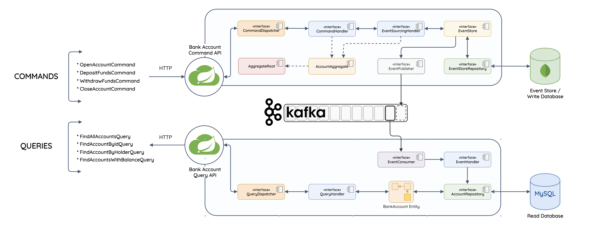

# [Giangbb Studio] - CQRS (Command query responsibility segregation) - Event sourcing Demo

This project is a Java-based application developed using Maven and Spring Boot. It is designed around the Command Query Responsibility Segregation (CQRS) pattern and implements event sourcing.

The project follows the principles of Domain-Driven Design (DDD). In this context, the aggregate (AccountAggregate) can be viewed as the domain entity on the write/command side, whereas the BankAccount model is the domain entity on the read/query side.

## Environment
* Spring Boot 3
* JDK 17
* Docker

## CQRS 
CQRS suggests that an application should be divided into a command and query part where commands alter the state of an object or entity while queries retrieves the state of an object or entity.

### Why CQRS?
- Data is often more frequently queried than altered or vice versa.
- By segregating commands and queries enables us to optimize each for high performance, read and write.
- Representations of data often differs substantially.
- Executing command and query operations on the same model can cause data contention.
- Segregating read and write concerns enables you to manage, read and write security separately.

## Event sourcing
Event sourcing defines an approach where all the changes that are made to an object or entity are stored as a sequence of immutable events to an event store, as opposed to just saving the current state of the object or entity.

### Why Event sourcing?
- The event store provides a complete log of every state change.
- The state of an object/aggregate can be recreated by replaying the event store.
- Improves write performance: All event types are simply appended to the event store. There're no update or delete operations.
- In the case of failure, the event store can be used to restore the read database.

### Aggregate
- An aggregate is an entity or group of entities that is always kept in a consistent state.
- The aggregate root is the entity within the aggregate that is reponsible for maintaining the aggregate's consistent state.

### Event Store:
- An event store is a database that is used to store data as a sequence of immutable events over time.
- An event store is a key enabler of event sourcing

### Architecture

